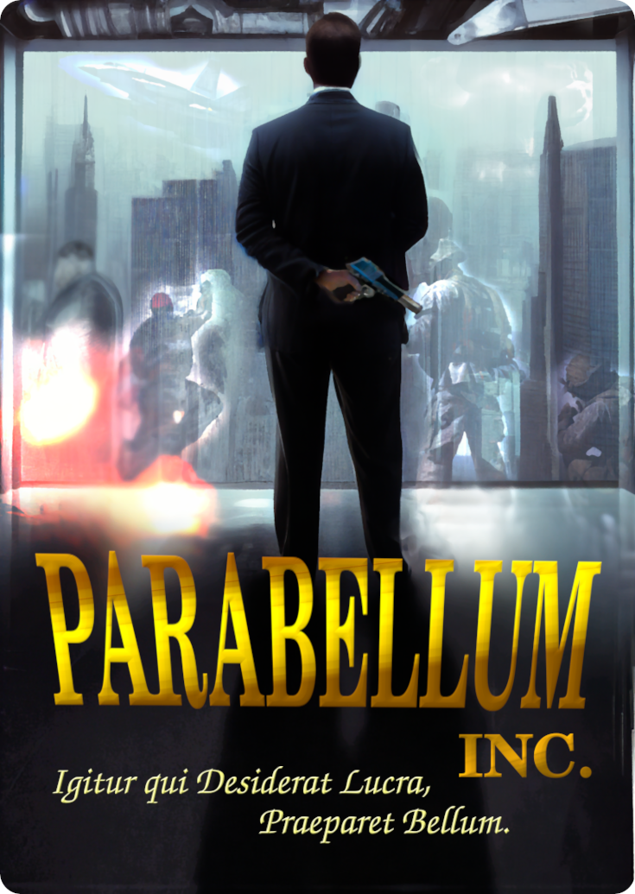

# Parabellum-Inc
Parabellum inc. is a resource-management focused war game set in a futuristic galaxy where humanity has spread and colonized worlds across the stars. Giant conglomerate corporations and their PMC affiliates wield the greatest power across the galaxy, and you play the role of an "Executive Sector Manager," a middle-management position that involves coordinating military forces that secure your company's primacy.

## The Premise of Parabellum Inc.

In a game of Parabellum Inc. your task is to direct company assets to achieve military objectives sent down by The Board of Directors.  You are given a meager budget by The Board with which to purchase, supply, and maintain the assets under your command.  There's nowhere near enough money to go around however, and you must use sucesses on the battlefield to both impress The Board and attract Business Partners to fund your operation.  But be careful: money from outside the company comes with strings attached, and if the debts come due when you can't pay, The Board isn't going to be happy.

## How To Play

Parabellum Inc. is played in part with miniatures on a gridded play area called the Battle Map. These represent Units of soldiers and vehicles on a Battlefield. Players move these Units around the Battle Map, use them to Attack Units controlled by the other players, and either Capture or Destroy their Objectives.  Different kinds of Units have different capabilities in terms of how far they can move in a given turn, how capable it is in Combat, and how many resources it requires to do so.  These Capabilities, and the status of each Unit is tracked using a Unit Tracking Card.  Movement is resolved by the Unit's capabilities and the Terrain indicated on the Battle Map.  Combat is resolved by opposing dice rolls, the kind and number of dice determined by the Unit's capabilities.  

Parabellum Inc. is also played in part with Tokens which are played on the Battle Map, as well as on Unit's Tracking Cards.  Tokens represent the Supplies of fuel and ammunition that the Units require, as well as the Supply Lines that get them to where they're needed. The player can place Supply Tokens onto the Battle Map, forming a Supply Line back to their starting area.  

These Tokens and the Units on the map also interact. If a Unit on the Battle Map is adjacent to a friendly Supply Line, the player can instead place the Supply Tokens onto that Unit's Card, refilling its Supplies and keeping it able to Move and Attack for a few more turns.  However, enemy Units can also move on your supply lines, Destroying them and forcing you to remove them from the Battle Map, or worse, Capturing your supplies for their own Units.

Finally, Parabellum Inc. is played with different kinds of Cards and play money called Credits.  Each player begins with an investment of Credits with which they purchase their first few Units and Supply Tokens and begin play.  As the game progresses, players will need to purchase more new Units, players will need to purchase more Supplies as the Units expend them and as they expand their Supply Lines across the Map.  Players will also need Credits to Extract Units from the board, to Repair Units that have suffered Losses, and to pay their Obligations.

At the end of each Battle, players that have achieved Objectives will recieve Bonuses of Credits from The Board.  This won't be nearly enough money however, and they'll need to find other ways to acquire funding.  Units and Supplies that aren't on the Map, (but have been paid for,) can be resold, but only for half their initial cost. Fortunately, there is a deck of cards called the Business Opportunity Deck.  If a player manages to Destroy an enemy Unit, Destroy or Capture enemy Supply Lines, or achieve one of the Battle's Objectives, they are entitled to draw a Business Opportunity Card at the end of their turn.  

Business Opportunity Cards can be Played at any time, and they have a Value, a Payoff, and Contingincies.  By playing them the player gets the card's value in either funding, Units, or Supplies.  However, once played, that player is beholden to meet the Contingincies imposed by the Business Opportunity Card.  For instance, Lines of Credit that must be Paid Off plus Interest at the end of the Battle, Sponsors who offer Units which must be returned at the end of the battle, or Investors who must be paid Dividends at the end of each battle.

And so, the game is revealed.  Play is divided into a series of Battles. (Called a Campaign.)  Each Battle consists of a map and a set of Objectives.  Once all the objectives of a Battle have been completed, Each player's Business Opportunity Contingincies come due.  They must pay with any Credits they have available, and if they don't have enough, they must either resell any Units and Supplies they have available, or play any Business Opportunity Cards they still have in hand.  The player with the most funds then selects the next Battle from the game box, and play continues.  A player is eliminated if they end a Battle and cannot pay the liabilities they owe on the Business Opportunity Cards they've played. The winner of a Campaign is the last player remaining.

Players must balance the risk of accumulating obligations by playing Business Opportunity Cards, with the possiblity of Purchasing new, more powerful Units and acheiving objectives for the bonuses they offer.  Or at least managing some victories on the battlefield will allow them to collect and play more Business Opportunities and keep themselves afloat for one more Battle.  Players must think tactically, making the most of the Units they have, keeping them flush with fuel and ammunition, draining their opponent's resources, forcing them to take on more and more debt to keep fighting.  

This is a general overview of the game, specific rules are divided into categories, and a sample game (TODO) is shown.

*Igitur qui desiderat lucra, praeparet bellum.*

Those who wish for riches, must prepare for war.
