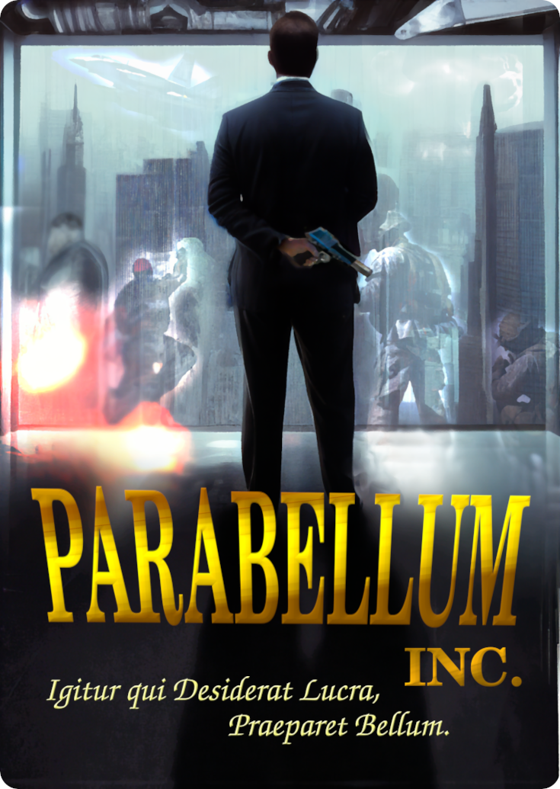

.

# Parabellum-Inc
Parabellum inc. is a resource-management focused war game set in a futuristic galaxy where humanity has spread and colonized worlds across the stars. Giant conglomerate corporations and their PMC affiliates wield the greatest power across the galaxy, and you play the role of an "Executive Sector Manager," a middle-management position that involves coordinating military forces that secure your company's primacy.

A game of Parabellum inc. is called a Campaign. Each Campaign consists of a series of Scenarios, which represent short skirmish-like battles with their own Maps, Objectives, and Special Circumstances. Each Campaign begins with a fixed Budget which the players must use to pay for Units, their associated costs, and upkeep, while they try to complete the objectives and exhaust their opponents resources.

